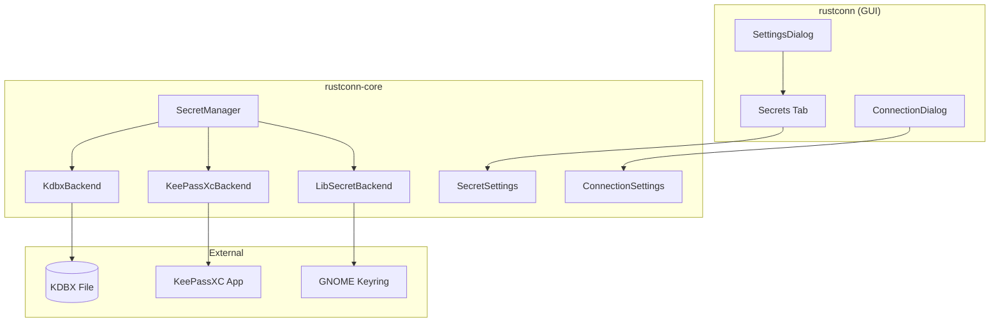

# Design Document: KeePass Integration

## Overview

This design document describes the enhanced KeePass integration for RustConn, providing a dedicated Secrets configuration tab in Settings, per-connection credential management options, and seamless password retrieval from KeePass databases during connection establishment.

The implementation extends the existing secret backend architecture to support direct KDBX file access alongside the existing KeePassXC browser integration, giving users flexibility in how they manage their credentials.

## Architecture



## Components and Interfaces

### 1. Extended SecretSettings (rustconn-core)

```rust
/// Secret storage settings with KeePass database support
#[derive(Debug, Clone, PartialEq, Eq, Serialize, Deserialize)]
pub struct SecretSettings {
    /// Preferred secret backend
    pub preferred_backend: SecretBackendType,
    /// Enable fallback to libsecret if KeePassXC unavailable
    pub enable_fallback: bool,
    /// Path to KeePass database file (.kdbx)
    #[serde(skip_serializing_if = "Option::is_none")]
    pub kdbx_path: Option<PathBuf>,
    /// Whether KeePass integration is enabled
    #[serde(default)]
    pub kdbx_enabled: bool,
    // Note: kdbx_password is NOT serialized for security
}

/// Extended backend type
#[derive(Debug, Clone, Copy, PartialEq, Eq, Default, Serialize, Deserialize)]
#[serde(rename_all = "snake_case")]
pub enum SecretBackendType {
    /// KeePassXC browser integration
    #[default]
    KeePassXc,
    /// Direct KDBX file access
    KdbxFile,
    /// libsecret (GNOME Keyring/KDE Wallet)
    LibSecret,
}
```

### 2. KeePass Integration Status

```rust
/// Status of KeePass integration
#[derive(Debug, Clone)]
pub struct KeePassStatus {
    /// Whether KeePassXC application is installed
    pub keepassxc_installed: bool,
    /// KeePassXC version if installed
    pub keepassxc_version: Option<String>,
    /// Path to KeePassXC binary
    pub keepassxc_path: Option<PathBuf>,
    /// Whether KDBX file is configured
    pub kdbx_configured: bool,
    /// Whether KDBX file exists and is accessible
    pub kdbx_accessible: bool,
    /// Whether integration is currently active (unlocked)
    pub integration_active: bool,
}

impl KeePassStatus {
    /// Detects current KeePass status
    pub fn detect() -> Self;
    
    /// Checks if KDBX file path is valid
    pub fn validate_kdbx_path(path: &Path) -> Result<(), String>;
}
```

### 3. KDBX Backend (New)

```rust
/// Direct KDBX file access backend
pub struct KdbxBackend {
    /// Path to the KDBX database file
    database_path: PathBuf,
    /// Database password (kept in memory only)
    password: Option<SecretString>,
    /// Cached database handle
    database: Option<KeePassDatabase>,
}

impl KdbxBackend {
    /// Creates a new KDBX backend
    pub fn new(database_path: PathBuf) -> Self;
    
    /// Unlocks the database with the given password
    pub async fn unlock(&mut self, password: SecretString) -> SecretResult<()>;
    
    /// Locks the database, clearing the password from memory
    pub fn lock(&mut self);
    
    /// Returns whether the database is currently unlocked
    pub fn is_unlocked(&self) -> bool;
}

#[async_trait]
impl SecretBackend for KdbxBackend {
    // Implementation of store, retrieve, delete, is_available
}
```

### 4. Credential Resolution Chain

```rust
/// Resolves credentials for a connection based on configuration
pub struct CredentialResolver {
    secret_manager: Arc<SecretManager>,
}

impl CredentialResolver {
    /// Resolves credentials for a connection
    /// 
    /// Resolution order:
    /// 1. If password_source is KeePass and integration active -> KeePass
    /// 2. If password_source is Keyring -> libsecret
    /// 3. If password_source is Stored -> connection config
    /// 4. Fallback chain based on settings
    /// 5. Return None (will prompt user)
    pub async fn resolve(&self, connection: &Connection) -> Option<Credentials>;
    
    /// Generates lookup key for KeePass entry
    pub fn generate_lookup_key(connection: &Connection) -> String;
}
```

### 5. Settings Dialog - Secrets Tab (GUI)

The Secrets tab will include:

1. **KeePass Database Section**
   - File path entry with browse button
   - Password entry (masked)
   - "Unlock" / "Lock" button
   - Status indicator (locked/unlocked/error)

2. **KeePassXC Status Section**
   - Installation status with version
   - Path to binary
   - Connection status

3. **Integration Toggle**
   - Master switch to enable/disable KeePass integration
   - Fallback options

### 6. Connection Dialog - Password Options

New fields in connection dialog:

1. **Password Source dropdown**
   - None (prompt each time)
   - Stored (in connection config)
   - KeePass
   - System Keyring

2. **Save to KeePass button**
   - Enabled only when KeePass integration is active
   - Saves current password to KeePass database

3. **Password field**
   - Standard password entry
   - "Use from KeePass" checkbox

## Data Models

### Extended Connection Model

The existing `Connection` model already has `password_source: PasswordSource` field which supports:
- `None` - No password stored
- `Stored` - Password in connection config
- `KeePass` - Password from KeePass
- `Keyring` - Password from system keyring
- `Prompt` - Always prompt user

### Session State

```rust
/// Runtime state for KeePass integration
pub struct KeePassSessionState {
    /// Whether KDBX database is currently unlocked
    pub unlocked: bool,
    /// Cached credentials (cleared on lock)
    pub cache: HashMap<String, Credentials>,
    /// Last error message
    pub last_error: Option<String>,
}
```

## Correctness Properties

*A property is a characteristic or behavior that should hold true across all valid executions of a system-essentially, a formal statement about what the system should do. Properties serve as the bridge between human-readable specifications and machine-verifiable correctness guarantees.*

### Property 1: KDBX Path Validation
*For any* file path string, the validation function SHALL return success only if the path ends with ".kdbx" extension (case-insensitive) and the file exists.
**Validates: Requirements 1.2**

### Property 2: Password Security in Memory
*For any* password stored in the KeePass settings, the password SHALL be wrapped in SecretString and not exposed through Debug or Display traits.
**Validates: Requirements 1.3**

### Property 3: Settings Serialization Round-Trip
*For any* valid SecretSettings, serializing to TOML and deserializing back SHALL produce equivalent settings, except the kdbx_password field which SHALL always be None after deserialization.
**Validates: Requirements 5.1, 5.2, 5.3**

### Property 4: Button State Consistency
*For any* KeePass integration state (enabled/disabled), the "Save to KeePass" button sensitivity SHALL equal the integration enabled state.
**Validates: Requirements 3.2, 3.3**

### Property 5: Credential Resolution Chain
*For any* connection with password_source set to KeePass, when KeePass integration is active, the resolver SHALL attempt KeePass lookup first; when lookup fails and fallback is enabled, the resolver SHALL try the next source in the chain.
**Validates: Requirements 4.1, 4.2, 4.3**

### Property 6: Lookup Key Generation
*For any* connection, the generated KeePass lookup key SHALL contain either the connection name or the host, ensuring consistent retrieval.
**Validates: Requirements 4.4**

### Property 7: Version String Parsing
*For any* valid KeePassXC version output string, the parser SHALL extract a non-empty version string.
**Validates: Requirements 2.2**

## Error Handling

### Error Types

```rust
/// KeePass-specific errors
pub enum KeePassError {
    /// Database file not found
    DatabaseNotFound(PathBuf),
    /// Invalid database file (not KDBX format)
    InvalidDatabase(String),
    /// Wrong password
    WrongPassword,
    /// Database is locked
    DatabaseLocked,
    /// Entry not found
    EntryNotFound(String),
    /// IO error
    Io(std::io::Error),
}
```

### Error Recovery

1. **Database not found**: Show error in status, disable integration
2. **Wrong password**: Show error, allow retry, don't lock out
3. **Entry not found**: Fall back to next source in chain
4. **IO errors**: Log error, show user-friendly message

## Testing Strategy

### Unit Testing

Unit tests will cover:
- Path validation logic
- Version string parsing
- Lookup key generation
- Settings serialization (without password)
- Button state logic

### Property-Based Testing

Using `proptest` library for property-based tests:

1. **KDBX path validation**: Generate random paths, verify only valid .kdbx paths pass
2. **Settings round-trip**: Generate random settings, verify serialization preserves data (except password)
3. **Credential resolution**: Generate various connection/settings combinations, verify correct source selection
4. **Lookup key generation**: Generate connections, verify keys contain expected identifiers

Each property-based test will:
- Run minimum 100 iterations
- Be tagged with the property it validates using format: `**Feature: keepass-integration, Property {N}: {description}**`
- Use smart generators that constrain to valid input space

### Integration Testing

Manual testing required for:
- Actual KDBX file operations
- KeePassXC communication
- End-to-end credential retrieval
