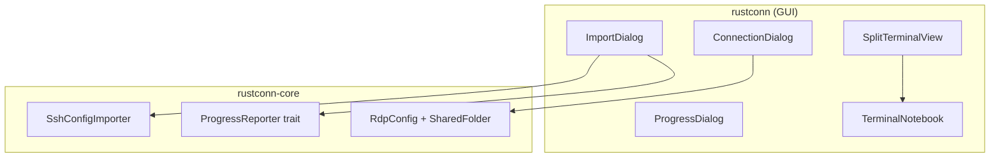
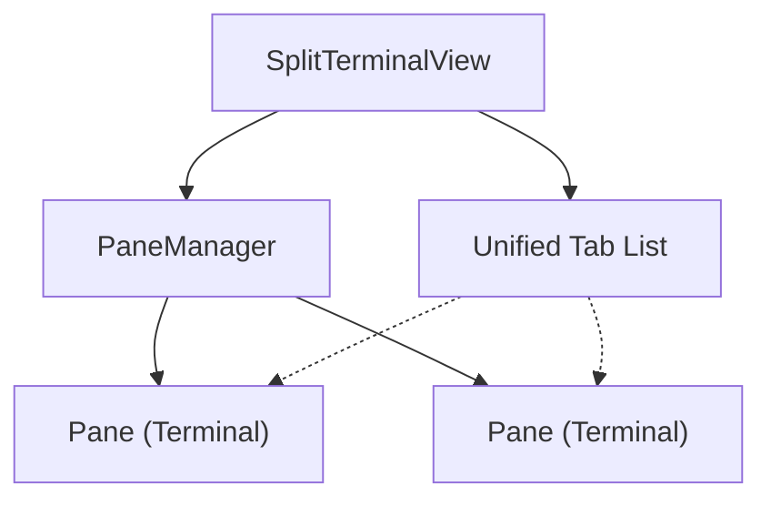

# Design Document: RustConn Enhancements

## Overview

This document describes the design for four major enhancements to RustConn:
1. Custom SSH config file import
2. RDP shared folder configuration
3. Progress indicators for long operations
4. Split-screen terminal views

## Architecture

### Component Diagram



## Components and Interfaces

### 1. Custom SSH Config File Import

#### Changes to `SshConfigImporter`

Add a new method to parse from a custom file path:

```rust
impl SshConfigImporter {
    /// Import from a custom SSH config file path
    pub fn import_from_file(&self, path: &Path) -> ImportResult {
        // Parse the file at the given path
    }
}
```

#### Changes to `ImportDialog`

Add new import source "SSH Config File" that:
1. Is always available (doesn't check for ~/.ssh/config)
2. Opens a file chooser dialog when selected
3. Parses the selected file using `SshConfigImporter::import_from_file()`

### 2. RDP Shared Folder Configuration

#### New Data Model

```rust
/// A shared folder for RDP connections
#[derive(Debug, Clone, PartialEq, Eq, Serialize, Deserialize)]
pub struct SharedFolder {
    /// Local directory path to share
    pub local_path: PathBuf,
    /// Share name visible in the remote session
    pub share_name: String,
}

/// Updated RDP configuration
pub struct RdpConfig {
    // ... existing fields ...
    /// Shared folders for drive redirection
    #[serde(default, skip_serializing_if = "Vec::is_empty")]
    pub shared_folders: Vec<SharedFolder>,
}
```

#### Command Builder Changes

Update RDP command builder to include shared folder arguments:

```rust
// For FreeRDP (xfreerdp)
// /drive:ShareName,/path/to/local/folder
for folder in &config.shared_folders {
    args.push(format!("/drive:{},{}", folder.share_name, folder.local_path.display()));
}
```

### 3. Progress Indicators

#### Progress Reporter Trait

```rust
/// Trait for reporting progress during long operations
pub trait ProgressReporter {
    /// Report progress update
    fn report(&self, current: usize, total: usize, message: &str);
    
    /// Check if operation was cancelled
    fn is_cancelled(&self) -> bool;
}

/// Callback-based progress reporter
pub struct CallbackProgressReporter {
    callback: Box<dyn Fn(usize, usize, &str)>,
    cancelled: Arc<AtomicBool>,
}
```

#### Progress Dialog Widget

```rust
pub struct ProgressDialog {
    window: Window,
    progress_bar: ProgressBar,
    status_label: Label,
    cancel_button: Button,
    cancelled: Rc<Cell<bool>>,
}

impl ProgressDialog {
    pub fn new(parent: Option<&Window>, title: &str, cancellable: bool) -> Self;
    pub fn update(&self, fraction: f64, message: &str);
    pub fn is_cancelled(&self) -> bool;
    pub fn close(&self);
}
```

### 4. Split-Screen Terminal Views

#### Architecture



#### Data Structures

```rust
/// Represents a split direction
#[derive(Debug, Clone, Copy)]
pub enum SplitDirection {
    Horizontal,
    Vertical,
}

/// A pane in the split view
pub struct TerminalPane {
    id: Uuid,
    container: GtkBox,
    current_session: Option<Uuid>,
}

/// Manages split terminal views
pub struct SplitTerminalView {
    /// Root container (Paned or single pane)
    root: GtkBox,
    /// All panes in the view
    panes: Rc<RefCell<Vec<TerminalPane>>>,
    /// Currently focused pane
    focused_pane: Rc<RefCell<Option<Uuid>>>,
    /// Shared session list (from TerminalNotebook)
    sessions: Rc<RefCell<HashMap<Uuid, TerminalSession>>>,
    /// Shared terminals map
    terminals: Rc<RefCell<HashMap<Uuid, Terminal>>>,
}

impl SplitTerminalView {
    /// Split the focused pane
    pub fn split(&self, direction: SplitDirection);
    
    /// Close the focused pane
    pub fn close_pane(&self);
    
    /// Cycle focus to next pane
    pub fn focus_next_pane(&self);
    
    /// Display a session in the focused pane
    pub fn show_session(&self, session_id: Uuid);
}
```

## Data Models

### SharedFolder

| Field | Type | Description |
|-------|------|-------------|
| local_path | PathBuf | Local directory path to share |
| share_name | String | Name visible in remote session |

### ProgressState

| Field | Type | Description |
|-------|------|-------------|
| current | usize | Current item number |
| total | usize | Total items to process |
| message | String | Current status message |
| cancelled | bool | Whether operation was cancelled |

## Correctness Properties

*A property is a characteristic or behavior that should hold true across all valid executions of a system-essentially, a formal statement about what the system should do. Properties serve as the bridge between human-readable specifications and machine-verifiable correctness guarantees.*

### Property 1: SSH Config Parsing Round Trip

*For any* valid SSH config content with Host entries, parsing the content should extract all Host entries with their associated settings (hostname, port, user, identity file).

**Validates: Requirements 1.2, 1.3**

### Property 2: Invalid SSH Config Error Handling

*For any* invalid SSH config content (malformed syntax), parsing should return an error result rather than silently failing or panicking.

**Validates: Requirements 1.4**

### Property 3: Shared Folder CRUD Operations

*For any* RDP configuration, adding a shared folder should increase the folder count by one, and removing a shared folder should decrease it by one, with the configuration remaining valid.

**Validates: Requirements 2.3, 2.5**

### Property 4: RDP Command Builder Includes Shared Folders

*For any* RDP configuration with shared folders, the generated command arguments should include a `/drive:` argument for each shared folder with correct share name and path.

**Validates: Requirements 2.4**

### Property 5: Progress Reporter Invocation

*For any* import operation with N items, the progress reporter should be called at least N times with monotonically increasing current values from 0 to N.

**Validates: Requirements 3.1, 3.3**

### Property 6: Split View Structure Integrity

*For any* sequence of split operations (horizontal or vertical), the resulting pane structure should contain exactly (initial_panes + split_count) panes, and closing a pane should reduce the count by one.

**Validates: Requirements 4.1, 4.2, 4.6**

### Property 7: Unified Tab List Consistency

*For any* split view with multiple panes, adding a session should make it available in all panes, and the total session count should equal the number of unique sessions regardless of pane count.

**Validates: Requirements 4.3**

### Property 8: Focus Cycling Completeness

*For any* split view with N panes, calling focus_next_pane() N times should cycle through all panes exactly once and return to the starting pane.

**Validates: Requirements 4.8**

## Error Handling

### SSH Config Import Errors

| Error | Handling |
|-------|----------|
| File not found | Display error dialog with file path |
| Permission denied | Display error dialog with suggestion to check permissions |
| Invalid format | Display error dialog with line number and description |
| Empty file | Display warning that no hosts were found |

### RDP Shared Folder Errors

| Error | Handling |
|-------|----------|
| Directory not found | Warn user before connection, allow proceeding |
| Permission denied | Warn user, suggest checking permissions |
| Invalid share name | Validate on input, show inline error |

### Progress Operation Errors

| Error | Handling |
|-------|----------|
| Operation cancelled | Close dialog, show "Cancelled" message |
| Partial failure | Complete operation, show summary with failures |

## Testing Strategy

### Unit Testing

- Test SSH config parsing with various valid configurations
- Test RDP command builder with different shared folder configurations
- Test progress reporter callback invocation
- Test split view pane management operations

### Property-Based Testing

Using `proptest` library as specified in tech stack:

1. **SSH Config Parsing**: Generate random valid SSH config content and verify parsing extracts all entries
2. **Shared Folder Operations**: Generate random add/remove sequences and verify count invariants
3. **RDP Command Builder**: Generate random shared folder configurations and verify command output
4. **Split View Operations**: Generate random split/close sequences and verify structure integrity
5. **Focus Cycling**: Generate random pane counts and verify cycling completeness

Each property-based test will:
- Run minimum 100 iterations
- Be tagged with format: `**Feature: rustconn-enhancements, Property {number}: {property_text}**`
- Reference the correctness property from this design document

### Integration Testing

- Test full import workflow with custom SSH config file
- Test RDP connection with shared folders
- Test progress dialog during bulk import
- Test split view with multiple terminal sessions
